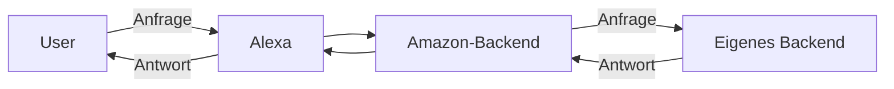
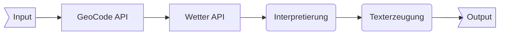

# regenZeit

Im Rahmen des Praktikums ist der Alexa-Skill "regenZeit" entstanden.
Im folgenden werde ich erklären

* was ein Alexa-Skill ist
* wie *ein* Alexa-Skill funktioniert
* wie *mein* Alexa-Skill funktioniert
* was bei der Implementierung zu beachten war

## Was ist ein Alexa-Skill?

Alexa ist der digitale Assistent von Amazon.
Er ist vergleichbar mit Assistenten anderer Anbieter wie Apples Siri oder dem Google Assistant.
Seine Aufgabe ist es, bei alltäglichen Aufgaben zu unterstützen.
Dabei führt er zum Beispiel Einkaufslisten, reserviert ein Restaurant oder steuert die Beleuchtung.
Das Besondere ist, dass er per Sprachbedienung gesteuert wird und sich so nahtlos in den Alltag eingliedern soll.

Alexa ist deshalb interessant, weil man als Entwickler eigene Programme dafür schreiben kann - sogenannte Skills.

## Funktionsweise *eines* Alexa-Skills

Ein Skill ist aufgeteilt in *Intents* und *Slots*.

Ein *Intent* (engl. 'Absicht') ist ein Teil des Programmes, den der Nutzer ausführt.
Dabei gibt es einige vordefinierte *Intents*, wie z.B. den AMAZON.StopIntent (beendet den Skill) oder den AMAZON.HelpIntent (ruft die Hilfe auf), man kann allerdings auch eigene *Intents* definieren.
Bei der Konfigurierung des Skills muss man einige Beispiele für das Auslösen des Intents angeben, sogenannte Utterances, damit Amazon eine Anfrage einem Intent zuordnen kann.

Ein *Slot* ist ein Datenfeld innerhalb einer Anfrage. Auch für diese werden in den Utterances Beispiele angegeben.
Ein solcher Slot kann zum Beispiel der *citySlot* sein. Dieser nimmt in meiner App eine beliebige Stadt in Deutschland an.

Ein typischer Aufbau Ablauf einer Abfrage sieht aus wie folgt:



Der Nutzer aktiviert Alexa durch das Keyword "Alexa" und macht seine Anfrage: "Frag regenZeit: Wie wird das Wetter heute in Bonn?".
Alexa reicht diese Eingabe weiter an das Amazon-Backend in Irland, wo diese Anfrage verarbeitet wird.
Dieses erkennt, dass:

* der Skill "regenZeit" angefordert wird
* der angeforderte *Intent* "ortIntent"(Hauptteil meiner App) ist
* der *citySlot* "Bonn" beinhaltet

Das Amazon-Backend reicht nun die Informationen über den Intent sowie den Inhalt des Slots an das eigene Backend weiter.
Dieses verarbeitet die Informationen und gibt den Antwort-Text zurück, der auch Rückfragen beinhalten kann.
Das Amazon-Backend reicht die Antwort nun einfach an Alexa weiter, welche aus dem Text per Text-To-Speech[^13] Sprache erzeugt und dem User ausgibt.

Für meinen Skill muss ich also nur mein eigenes Backend schreiben. Dinge wie die Spracherkennung erledigt Amazon für mich.
Dadurch ist es vergleichsweise einfach, für die Platform zu programmieren.

[^13]: Technik, die einem Computer ermöglicht aus Text Sprache zu erzeugen

## Funktionsweise *meines* Alexa-Skills

Mein Skill nimmt einen Städtenamen entgegen und fragt dann an einer Wetter-API die Regenwahrscheinlichkeit für die nächste Zeit ab.
Eine Beispiel-Utterance für den Intent "ortIntent" ist die folgende:

```text
"Wie ist das wetter in {citySlot}"
```

Sagt der Nutzer nun

```text
"Alexa, frag regenZeit: Wie ist das Wetter in Bonn?"
```

So bekommt mein Backend folgende Information:

* *ortIntent* ist der aufgerufene Intent
* *citySlot* hat den Wert "Bonn"

Für die Wetter-API nützt mir leider "Bonn" nicht viel - diese verlangt genaue Koordinaten als Eingabe.
Deshalb frage ich vorher bei der Google Maps GeoCode-API ab, wie die Koordinaten für "Bonn" sind.
Mit diesen Koordinaten kann ich dann die Wetter-API anfragen, welche mir eine Zeichenfolge zurückgibt.
Darin steht ein Unterstrich für keinen Regen, die Buchstaben *A* bis *F* für Regen in aufsteigender Intensität.
Jedes Zeichen repräsentiert eine Minute, von jetzt aus gesehen.
Nachdem diese Vorhersage interpretiert wurde, erzeuge ich den Ausgabetext und gebe die Antwort zurück.

Bei jeder Anfrage von "ortIntent" sieht die Vorgehensweise also wie folgt aus:



Um den Skill weniger statisch wirken zu lassen, werden die Ausgaben aus verschiedenen Bausteinen zufällig zusammengesetzt.

## Besonderheiten in der Umsetzung

Die Entwicklung für Alexa bedeutet nicht nur, dass ich eine mir für mich neue Programmiersprache benutzen muss (JavaScript), sondern auch die Arbeit mit HTTP-GET Anfragen, mit denen ich davor noch keine Erfahrung hatte. Die Schlüsselstellen erkläre ich gesondert hier, der gesamte Quelltext lässt sich unter [*github.com/skn0tt/regenZeitPub*](github.com/skn0tt/regenZeitPub) einsehen.

### Genutzte Frameworks

* node.js
* Express
* alexa-app
* https
* @google/maps

*node.js* ist ein Framework, das es ermöglicht, JavaScript in der Backend-Entwicklung einzusetzen.
Während JavaScript früher nur in Webseiten benutzt wurde, um auf der Benutzer-Seite Dinge auszuführen, macht node.js Javascript zur einzigen Sprache, die sowohl im Frontend als auch im Backend genutzt werden kann.

```js
const express = require("express");
```
*Express* ist ein Framework für node.js, welches es deutlich vereinfacht einen HTTP-Server aufzusetzen.

```js
const alexa = require("alexa-app");
```
*alexa-app* ist ein Framework für node.js, welches viele Funktionen für die Alexa-Entwicklung schon mitbringt.

```js
const googleMapsClient = require('@google/maps').createClient({
  key: 'HIER_API_KEY_EINFÜGEN',
});
```
*Google Maps* erleichtert den Zugriff auf die GeoCode-API.

### Aufteilung des Codes

Ich habe den Code in vier Module aufgeteilt:

* app.js (nimmt die Anfragen entgegen)
* speech.js (erzeugt Antworten)
* settings.js (enthält Einstellungen)
* error.js (enthält Fehler-Codes)


### Abfragen

```js
function(request, response) {
  return getCoordinates(request.slot("citySlot"))
    .then((res) => {
      return getWeather(res);
    })
    .then((res) => {
      response.say(speech.prognosis.de(res.prog, res.length, res.address));
    });
}
```
Dieser Block wird ausgeführt, wenn der "ortIntent" abgefragt wird.
Er gibt ein sogenanntes *Promise* zurück.
Die Verwendung von Promises ist zwingend erforderlich, da HTTP-Abfragen nicht in Echtzeit geschehen können und die Antwort sonst immer fehlerbehaftet wäre.

*Promises* sind sehr treffend benannt: Sie sind ein Versprechen, dass irgendwann eine Antwort kommt - diese aber jetzt noch nicht bereit ist.
Das Amazon-Backend wartet also bis der Promise beendet ist, und gibt die Antwort erst dann zurück.
In JavaScript kann für die Verkettung solcher Promises `.then()` benutzt werden.
Dies Funktion wird immer nach Beendigung eines Promises ausgeführt und kann benutzt werden, um basierend auf der Antwort den nächsten Promise zu starten.

### Umwandlung der Fehlermeldungen

```js
alexaApp.post = function(request, response, type, exception) {
  if (exception) {
    console.log(exception);
    return response.clear()
      .say(speech.error.de(exception))
      .send();
  }
};
```

Damit der Nutzer von Alexa keine unschönen Fehlermeldungen erhält, prüfe ich nach jeder Anfrage ob eine solche vorliegt.
Tut sie das, wird sie in eine erfolgreiche Ausgabe umgewandelt.